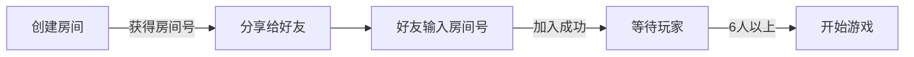

<div align="center">

# 🐺 狼人杀联机版

### *Werewolf Online*


<br/>

**✨ 一款支持 6~18 人实时在线对战的狼人杀游戏**

星空月夜主题 · 实时语音级交互 · 完整游戏系统 · 多端兼容

[🚀 快速开始](#-快速开始) · [🎭 角色介绍](#-角色介绍) · [🎮 游戏功能](#-游戏功能) · [🛠 技术栈](#-技术栈)

</div>

---

## 🌙 项目简介

**狼人杀联机版** 是一款基于 Web 的实时多人社交推理游戏。无需下载客户端，打开浏览器即可与好友联机对战。项目采用**星空月夜视觉主题**，配合**中国风书法字体**，营造沉浸式的狼人杀氛围。

<div align="center">

```
┌─────────────────────────────────────────────────────────────┐
│  🌌 星空月夜背景    🎭 9大角色    ⚡ 实时对战    📱 多端兼容  │
│  🏠 房间系统        💬 双频道聊天   🔌 断线保护   ⏱️ 限时投票  │
└─────────────────────────────────────────────────────────────┘
```

</div>

---

## ✨ 游戏功能

### 🎯 核心玩法

| 功能 | 描述 | 状态 |
|:----:|:-----|:----:|
| 🏠 **房间系统** | 6位随机房间号，支持密码保护，最多18人 | ✅ |
| 🎭 **角色系统** | 9种角色，自动平衡配置，支持自定义 | ✅ |
| 🌙 **昼夜交替** | 完整的夜晚行动 + 白天讨论投票流程 | ✅ |
| 💬 **实时聊天** | 狼人密聊 + 遗言系统 + 快捷发言 | ✅ |
| ⚡ **实时对战** | WebSocket双向通信，延迟<100ms | ✅ |

### 🎪 特色系统

| 功能 | 描述 | 状态 |
|:----:|:-----|:----:|
| 🔊 **音效系统** | 12种场景音效，Web Audio API合成 | ✅ |
| 📜 **旁白系统** | 游戏旁白播报，支持TTS语音 | ✅ |
| ⭐ **警长系统** | 竞选演讲、投票选举、警徽移交 | ✅ |
| 👁️ **观战模式** | 最多5人同时观战，实时观看对局 | ✅ |
| 📹 **游戏回放** | 完整对局记录，支持回放查看 | ✅ |
| 😊 **表情互动** | 12种表情包 + 10种快捷发言 | ✅ |
| 📊 **战绩统计** | 胜率、连胜、角色胜率等数据 | ✅ |
| 📨 **邀请链接** | 一键生成邀请链接，支持二维码 | ✅ |

### 🎭 角色能力

| 角色 | 图标 | 阵营 | 技能描述 |
|:----:|:----:|:----:|:---------|
| 狼人 | 🐺 | 🐺 狼人 | 每晚与队友商议并猎杀一名玩家 |
| 村民 | 👨‍🌾 | 🌿 好人 | 无特殊能力，通过推理和投票找出狼人 |
| 预言家 | 🔮 | 🌿 好人 | 每晚查验一名玩家身份（好人/狼人） |
| 女巫 | 🧪 | 🌿 好人 | 拥有一瓶解药和一瓶毒药，各限一次 |
| 猎人 | 🏹 | 🌿 好人 | 被淘汰时可开枪带走一名玩家 |
| 守卫 | 🛡️ | 🌿 好人 | 每晚守护一名玩家，不可连续守护同一人 |
| 白痴 | 🤪 | 🌿 好人 | 被投票出局时可翻牌存活，但失去投票权 |
| 长老 | 👴 | 🌿 好人 | 有两条命，但被女巫毒杀直接死亡 |
| 丘比特 | 💘 | 🌿 好人 | 首夜连接两名玩家为情侣，同生共死 |

---

## 🚀 快速开始

### 环境要求

- **Node.js** ≥ 18
- **npm** ≥ 9

### 安装与启动

```bash
# 📦 克隆仓库
git clone https://github.com/20190441309/Werewolf-game.git

# 📂 进入项目目录
cd Werewolf-game

# 📥 安装依赖
npm install

# 🚀 启动服务器
npm start
```

<br/>

<div align="center">

### 🎮 打开浏览器访问

```
http://localhost:3000
```

</div>

### 🎯 邀请好友



---

## 🛠 技术栈

<div align="center">

### 后端


### 前端


### 测试 & DevOps


</div>

---

## 📁 项目结构

```
Werewolf-game/
├── 📂 .github/
│   └── 📂 workflows/
│       └── ⚙️ e2e.yml              # GitHub Actions CI 配置
├── 📂 public/
│   └── 🌐 index.html               # 前端主页面（含所有UI和逻辑）
├── 📂 tests/
│   └── 📂 playwright/
│       └── 🧪 e2e.spec.js          # 端到端测试用例
├── 🖥️ server.js                    # Express + Socket.IO 服务端核心
├── 🎮 werewolf-game.html           # 游戏主页面（单机版）
├── 📋 DEVELOPMENT_PLAN.md          # 开发计划文档
├── ⚙️ playwright.config.js         # Playwright 配置
├── 📦 package.json                 # 项目依赖配置
└── 📖 README.md                    # 项目说明文档
```

---

## 🎮 游戏流程

```
┌────────────────────────────────────────────────────────────────┐
│                                                                │
│   🏠 大厅等待  →  🎭 角色分配  →  🌙 夜晚行动  →  ☀️ 白天讨论  │
│        ↑                                            │         │
│        │                                            ↓         │
│        └──────────── 🗳️ 投票放逐 ←───────────────────┘         │
│                                                                │
│                    🔄 循环直到胜负揭晓                          │
│                                                                │
└────────────────────────────────────────────────────────────────┘
```

### 胜负判定

<div align="center">

| 阵营 | 胜利条件 |
|:----:|:---------|
| 🌿 **好人阵营** | 消灭所有狼人 |
| 🐺 **狼人阵营** | 存活狼人数 ≥ 存活好人数 |

</div>

---

## 🧪 测试

### 运行测试

```bash
# 安装 Playwright 浏览器
npm run prepare:e2e

# 运行端到端测试
npm run test:e2e
```

### CI/CD 流水线

每次 `push` 到 `main` 分支时，GitHub Actions 会自动执行：

- ✅ 依赖安装
- ✅ Playwright 浏览器初始化
- ✅ 全量 E2E 测试
- ✅ 测试报告归档

---

## 🤝 贡献指南

欢迎提交 Issue 或 Pull Request！

```bash
# 1. Fork 本仓库

# 2. 创建特性分支
git checkout -b feature/amazing-feature

# 3. 提交更改
git commit -m 'feat: add amazing feature'

# 4. 推送分支
git push origin feature/amazing-feature

# 5. 提交 Pull Request
```

---

## 📜 开源协议

本项目基于 [MIT License](LICENSE) 开源。

---

<div align="center">

### 🌙 月圆之夜，谁是狼人？

**⭐ 如果觉得有用，请给个 Star 支持一下！**

<br/>


<br/>

Made with ❤️ by [Huang Jun](https://github.com/20190441309)

</div>
